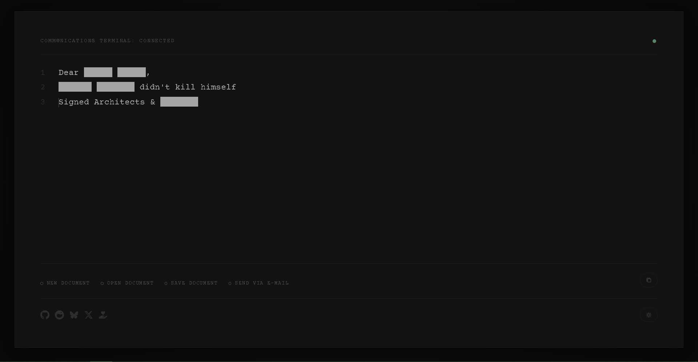
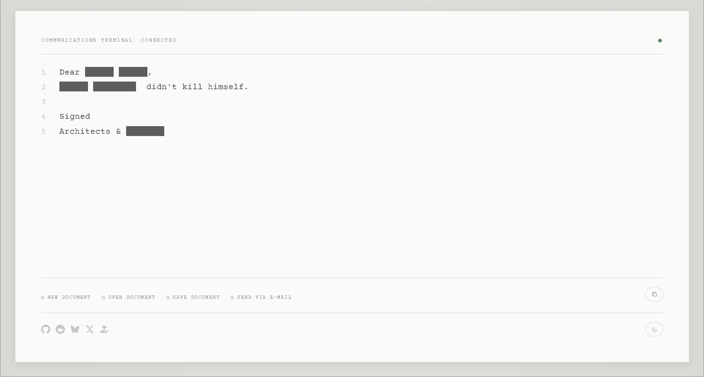
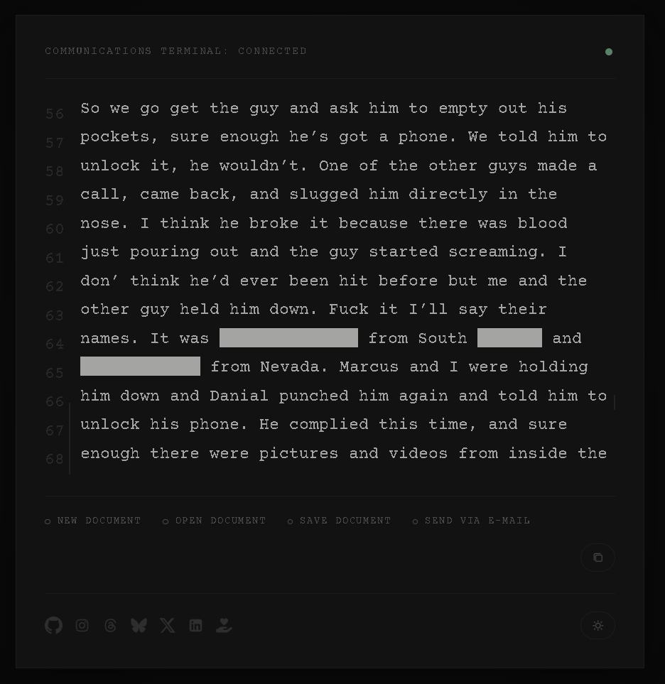

# Dear Redacted Composer

<p align="center">
  
</p>

<p align="center">
  A self-redacting writing environment that censors language in real time.
</p>

<p align="center">
  <a href="https://dear-redacted.github.io/composer/">
    
  </a>
  
  <a href="https://github.com/Dear-Redacted/composer/releases">
    
  </a>
</p>

<p align="center">
  
  
  
  
</p>

---

## Overview

A digital composer invites you in, but the computer watches exactly how you type. You may write a letter to the powerful, but be warned: the machine knows the exact words you are looking for. As soon as you type a specific name, characteristic, or crime, it vanishes behind a thick black bar, forcing you to find an entirely new way to speak.

Dear Redacted Composer is Artwork 1/40, and the name-giving piece for the exhibit Dear Redacted. It directly targets the predictable media scripts that dictate how we usually discuss sweeping scandals. By censoring specific keywords in real-time, the program pushes the visitor toward creative circumlocution. It effectively breaks the standard cycle of outrage-by-proxy. The user is required to engage their own original thought and vocabulary to successfully bypass the strict digital filter.

This project exists simultaneously as:

- an experimental writing tool
- an interactive artwork
- a digital installation component
- a conceptual response to censorship, memory, and institutional failure

---

## Experience the Work

### Live Web Version

The browser-based version is available here:

### https://dear-redacted.github.io/composer/

---

## Screenshots

### Editor Dark Interface



---

### Editor Light Interface



---

### Editor Small Interface



---

## Core Features

- Real-time keyword censorship
- Irreversible in-session redaction
- Local text file export
- Email composition integration
- Minimal intentionally constrained interface
- Desktop and web deployment targets
- Curatable keyword system
- Cross-platform web rendering

---

## How It Works

Every document begins with a fixed opening prompt:

```text
Dear
```

As the user types, the editor continuously scans input against a predefined keyword list.

When a blocked word is detected:

- the original text is destroyed in-session
- the word is replaced with same-length redaction bars
- deleting characters only shortens the bar
- the original word cannot be recovered

Example:

```text
███████
```

The censorship mechanic itself is the artwork.

---

## Why the Redaction Matters

The project directly challenges predictable public language surrounding institutional abuse, power, and collective memory.

Most public discourse eventually collapses into repetition:
- repeated headlines
- repeated outrage
- repeated narratives
- repeated scripts

Dear Redacted Composer interrupts this process mechanically.

The software removes linguistic shortcuts and forces users to reconstruct meaning manually through detours, substitutions, implication, metaphor, and invention.

The goal is not silence.

The goal is to force original speech.

---

## Technical Notes

Dear Redacted Composer is intentionally minimal.

It is not designed to compete with traditional word processors such as Microsoft Word, Notepad++, or Google Docs. The constrained feature set is deliberate and forms part of the artistic structure of the work.

### Current Capabilities

- Create drafts
- Save drafts locally
- Export text
- Send text via email
- Run as desktop or web application

---

## Keyword System

The forbidden-word list is predefined and treated as curatorial material.

The list can be adapted for different installations or exhibit contexts.

### Modifying the Keyword List

1. Create your keyword list in English
2. Encode the list using Base64
3. Replace the current encoded value in:

```text
constants.ts
```

---

## Installation

### Prerequisites

- Node.js

---

### Clone Repository

```bash
git clone https://github.com/Dear-Redacted/composer.git
```

---

### Install Dependencies

```bash
npm install
```

---

## Development

### Start Desktop + Web Development Environment

```bash
npm run dev
```

### Start Web Renderer Only

```bash
npm run dev:renderer
```

---

## Build Commands

### Full Production Build

```bash
npm run build
```

### Static Web Build

```bash
npm run build:web
```

### Portable Windows Build

```bash
npm run build:desktop
```

---

## Cleaning Build Outputs

>Clean is automatically applied during the Full Production Build.

### Clean Web Output

```bash
npm run clean:web
```

### Clean Desktop Output

```bash
npm run clean:desktop
```

### Clean Everything

```bash
npm run clean
```

---

## Releases

### GitHub Release Build

```bash
npm run release:desktop
```

Windows installer and portable artifacts are distributed through GitHub Releases.

### Current Release Notes

- Releases are currently unsigned
- Windows SmartScreen warnings may appear on first launch

---

## About Dear Redacted

Dear Redacted Composer is one component of the larger *Dear Redacted* exhibition created by the collective **Architects & Redacted**.

The exhibition explores:
- censorship
- institutional collapse
- trauma progression
- memory
- public language
- collective denial

Additional conceptual, curatorial, and artistic context can be found in:

## [STATEMENT.md](./STATEMENT.md)

---

## Follow the Project

### X / Twitter

https://x.com/redact_exhibit

### Instagram

https://www.instagram.com/dear.redacted.exhibit/

### Threads

https://www.threads.com/@dear.redacted.exhibit

### Bluesky

https://bsky.app/profile/dear-redacted.bsky.social

### LinkedIn

https://linkedin.com/in/dear-redacted

---

## Support

Support the project directly on Patreon:

### https://patreon.com/DearRedacted

---

## [License](./License.md)

---

## Acknowledgements

Created by Architects & Redacted.

Part of the ongoing Dear Redacted exhibition.
